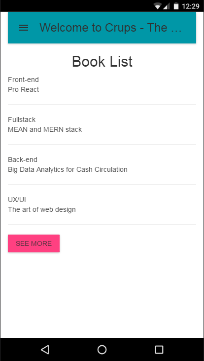
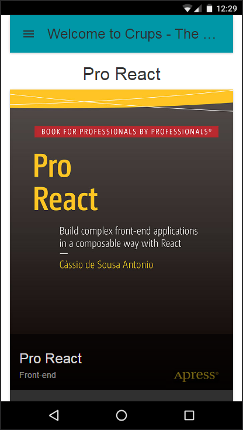
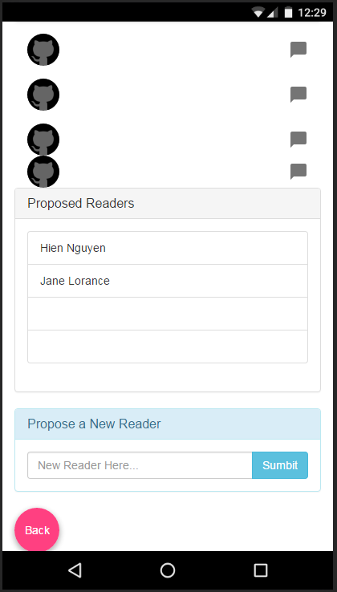

# Crups

## What is this?
A simple app with MERN - MongoDB,Express,ReactJS,Node

## Tech used
+ MERN
+ Material design
+ Isomorphic with server and front-end rendering 

## How to install
+ Clone this repo `git clone <this-repo>` or download as zip file
+ Run `npm install` 
+ Start MongoDB `mongod`
+ Test database `babel-node loadTestData.js`
+ Run `npm start` to start the server 
+ Run `npm dev` at the same time in another terminal
+ Change the ip address in the `config.js` file to the local machine is running
+ Open browser run `0.0.0.0:3000`(with your ip address)

## Demos

## Built intergrated with 
+ https://github.com/Hashnode/mern-starter

## Developer:
Hien Nguyen
